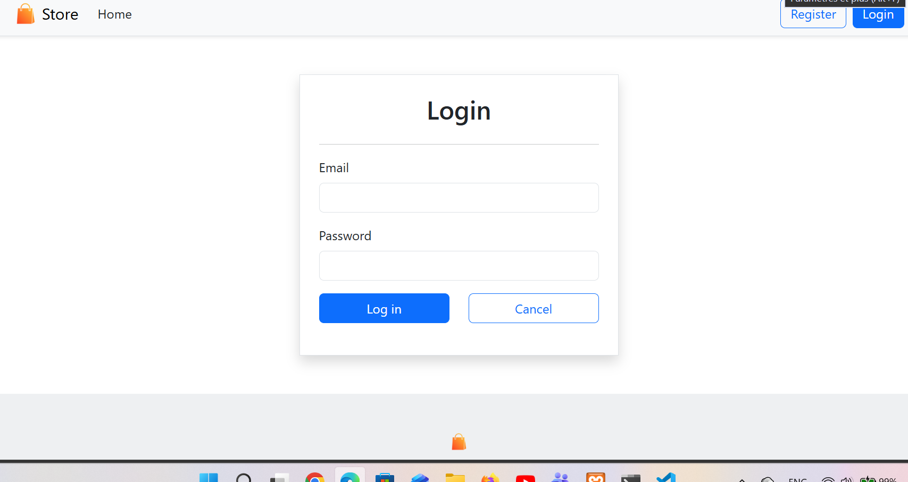
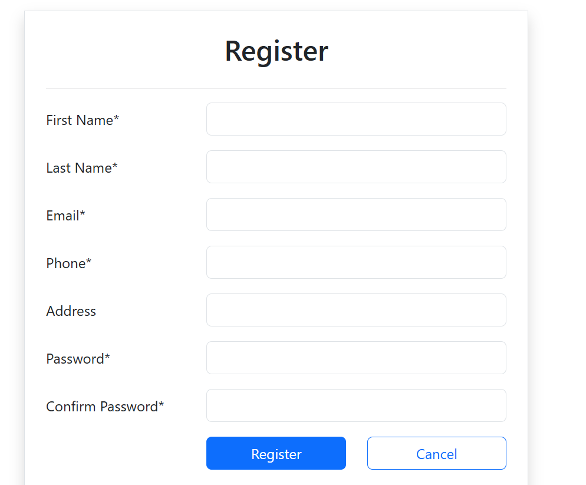

# 🛒 StoreDB

A simple Electronic Store web application built with **PHP** and **MySQL**.

This project allows users to register, log in, and browse the homepage. It also includes an admin panel for managing the application.

---

## ✨ Features

- User Registration
- User Login
- User Logout
- User Profile
- Admin Dashboard
- MySQL Database
- Responsive Design using Bootstrap
- Session Authentication

---

## 🛠 Technologies Used

- PHP
- MySQL
- HTML5
- CSS3
- Bootstrap 5
- JavaScript

---

## 📁 Project Structure

```
Store/
│
├── database/
│   └── storedb.sql
│
├── images/
│
├── layout/
│   ├── header.php
│   └── footer.php
│
├── tools/
│
├── admin.php
├── index.php
├── login.php
├── logout.php
├── profile.php
├── register.php
│
├── README.md
└── .gitignore
```

---

## 🚀 Installation

### 1. Clone the repository

```bash
git clone https://github.com/YOUR_USERNAME/StoreDB.git
```

### 2. Move the project

Copy the project into your web server directory.

For XAMPP:

```
htdocs/Store
```

---

### 3. Create the database

Create a new MySQL database named:

```
storedb
```

---

### 4. Import the database

Import the SQL file located in:

```
database/storedb.sql
```

---

### 5. Configure the database connection

Update your database configuration with your MySQL credentials.

Example:

```php
$host = "localhost";
$dbname = "storedb";
$user = "root";
$password = "";
```

---

### 6. Run the project

Open your browser and visit:

```
http://localhost/Store
```

---

## 📸 Screenshots

You can add screenshots of:

- Home Page
- Login Page
- Register Page
- Profile Page
- Admin Dashboard

---

## 🎯 Future Improvements

- Product Management
- Shopping Cart
- Product Categories
- Search Products
- User Roles
- Password Reset
- Email Verification
- Responsive Admin Dashboard

---
# 📸 Screenshots

## Home Page


---

## Login Page



---

## Register Page



---

## Profile Page


---

## Admin Dashboard


## 👨‍💻 Author

**Hamza Ty**

GitHub:
https://github.com/YOUR_USERNAME

---

## 📄 License

This project is for educational purposes.
